# Bellomo_Classifier
Riccardo Cuccia, 1000014871

CDL Informatica Triennale, Università degli Studi di Catania

Progetto per l'esame di Machine Learning, A.A. 2022/2023

## Problema

Il problema affrontato è la classificazione di 16 opere differenti presenti all'interno del museo Bellomo di Siracusa. Partendo dal dataset fornito, si è cercato di creare un classificatore che, dato in input un'immagine, restituisca in output il nome dell'opera rappresentata.

Questo progetto può essere utile per la creazione di un'applicazione mobile che, tramite la fotocamera, permetta di riconoscere le opere presenti all'interno del museo Bellomo, e se allenato con un dataset più ampio, potrebbe essere utilizzato per riconoscere opere presenti in altri musei.

## Dataset

Il dataset utilizzato proviene dal lavoro di Giovanni Pasqualino, Antonino Furnari e Giovanni Maria Farinella, scaricabile per intero da questo [Link](https://iplab.dmi.unict.it/OBJ-MDA/OBJ_MDA.zip). Di seguito viene riportata la struttura del dataset:

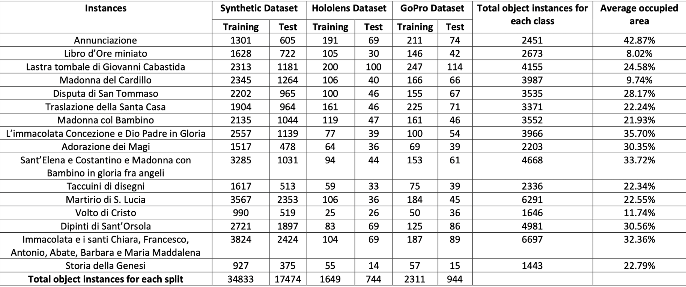

Il dataset è composto da 3 sottocartelle, una per ogni metodo di acquisizione delle immagini: Synthetic, GoPro ed Hololens. All'interno di ognuna di queste sottocartelle sono presenti dei file .json che contengono le informazioni riguardanti le immagini.

Un json è composto da due array: "images" e "annotations". Il primo contiene informazioni riguardanti le immagini, come il nome del file, l'altezza e la larghezza in pixel, l'id e la cartella in cui è contenuta. Il secondo contiene informazioni riguardanti le annotazioni, come l'id dell'immagine a cui si riferisce, il nome dell'opera, la posizione dell'opera all'interno dell'immagine e la sua dimensione.
Di seguito una tabella che mostra un esempio di come sono strutturati i file .json:

Images:
|    | file_name                                |   height |   width |   id |
|---:|:-----------------------------------------|---------:|--------:|-----:|
|  0 | Navigation_02/Rgb/Rgb_image_00000000.jpg |      720 |    1280 |    0 |
|  1 | Navigation_02/Rgb/Rgb_image_00000001.jpg |      720 |    1280 |    1 |
|  2 | Navigation_02/Rgb/Rgb_image_00000002.jpg |      720 |    1280 |    2 |
|  3 | Navigation_02/Rgb/Rgb_image_00000003.jpg |      720 |    1280 |    3 |
|  4 | Navigation_02/Rgb/Rgb_image_00000004.jpg |      720 |    1280 |    4 |

Annotations:
|    | segmentation                                              |   iscrowd |   image_id |   category_id |   id | bbox                         |     area |
|---:|:-|----------:|-----------:|--------------:|-----:|:-----------------------------|---------:|
|  0 | [[1165.0, 419.5, 1165.5, ...]]|         0 |         14 |             6 |    0 | [1082.5, 239.5, 99.0, 180.0] | 14727    |
|  1 | [[879.0, 306.5, 880.5, ...]]                                                  |         0 |         15 |             5 |    2 | [1018.5, 119.5, 52.0, 151.0] |  4220.5  |
|  3 | [[1219.0, 341.5, 1220.5, ...]] |         0 |         15 |             4 |    3 | [1110.5, 49.5, 170.0, 292.0] | 30873.8  |
|  4 | [[656.0, 205.5, 656.5, ...]]|         0 |         16 |             6 |    4 | [596.5, 42.5, 62.0, 163.0]   |  9488.75 |                                                                                    

### Preprocessing

Il dataset fornito è stato modificato per poter creare un classificatore che facesse rifermento solamente alle feature relative alle opere d'arte, e non al resto dell'immagine. Per fare ciò, dal dataset originale sono state estratte le immagini e la loro classe di appartenenza, e dalle annotazioni è stato ottenuto il bounding box per effettuare il crop dell'immagine solamente sulla porzione interessata. Di seguito un esempio di come sono state modificate le immagini:

Immagine iniziale:
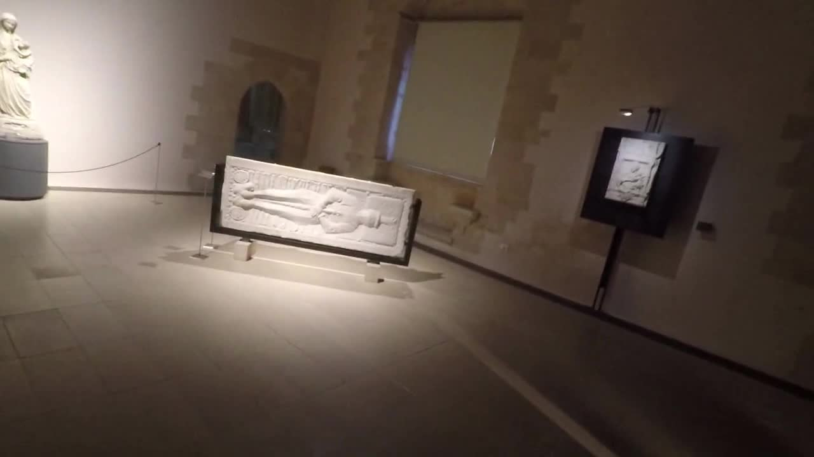

Dopo il preprocessing: 
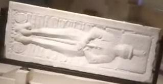 
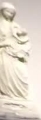

Le immagini del museo, com'è possibile notare, possono mostrare diverse opere contemporaneamente, e per questo motivo è stato necessario effettuare un crop per ogni opera presente nell'immagine.

È stata inoltre utilizzata una nuova organizzazione delle cartelle: L'intero dataset preprocessato si trova all'interno della cartella "data/cropped_Datasets", che come nel dataset originale presenta 3 sottocartelle, una per ogni metodo di acquisizione delle immagini. All'interno di queste sottocartelle è presente una cartella per ogni classe, e all'interno di queste cartelle sono presenti le immagini di quella classe. Considerando che la struttura del dataset originale presenta una suddivisione del dataset corrispettiva alle diverse fasi di acquisizione dello stesso (es. "GoPro/Test/Test9" e "Gopro/Test/Test10"), è stato necessario rinominare le immagini includendo il percorso, in modo da eliminare evenutali omonimi.

## Metodi

Il modello è stato allenato utilizzando il transfer learning, importando i pesi di default di Torchvision. È stato modificato l'ultimo layer in modo da ottenere in output 16 classi, e successivamente è stato allenato il modello con il dataset preprocessato. È stato deciso di rispettare la suddivisione del dataset originale, e quindi non alterare training, test e validation set.

È stato scelto di utilizzare il transfer learning in quanto risulta essere molto conveniente in termini di tempo e risorse, permettendo il raggiungimento di buoni risultati in poco tempo.

## Valutazione

In fase di training è stata utilizzata la cross entropy loss come funzione di costo, e l'ottimizzatore SGD con learning rate 0.001 e momentum 0.9. Il modello è stato allenato per 15 epoche. È inoltre stato utilizzato un learning rate scheduler, che riduceva il learning rate di un fattore 0.1 ogni 7 epoche.

In fase di test è stata creata la confusion matrix per valutare le performance del modello, e sono stati calcolati i valori di precision, recall e f1 score per ogni classe.

eseguendo da terminale il comando "tensorboard --logdir ./code/runs" è possibile visualizzare i grafici di accuracy e loss per il training e il validation set, nei diversi esperimenti.

## Esperimenti

### Esperimento 1 - Squeezenet

Per il primo esperimento è stato utilizzato il modello squeezenet, nella sua versione 1_1. Questo modello è stato scelto in quanto risulta essere molto leggero, e quindi permette di allenare il modello in poco tempo. Di seguito i grafici accuracy e loss per il training e il validation set:

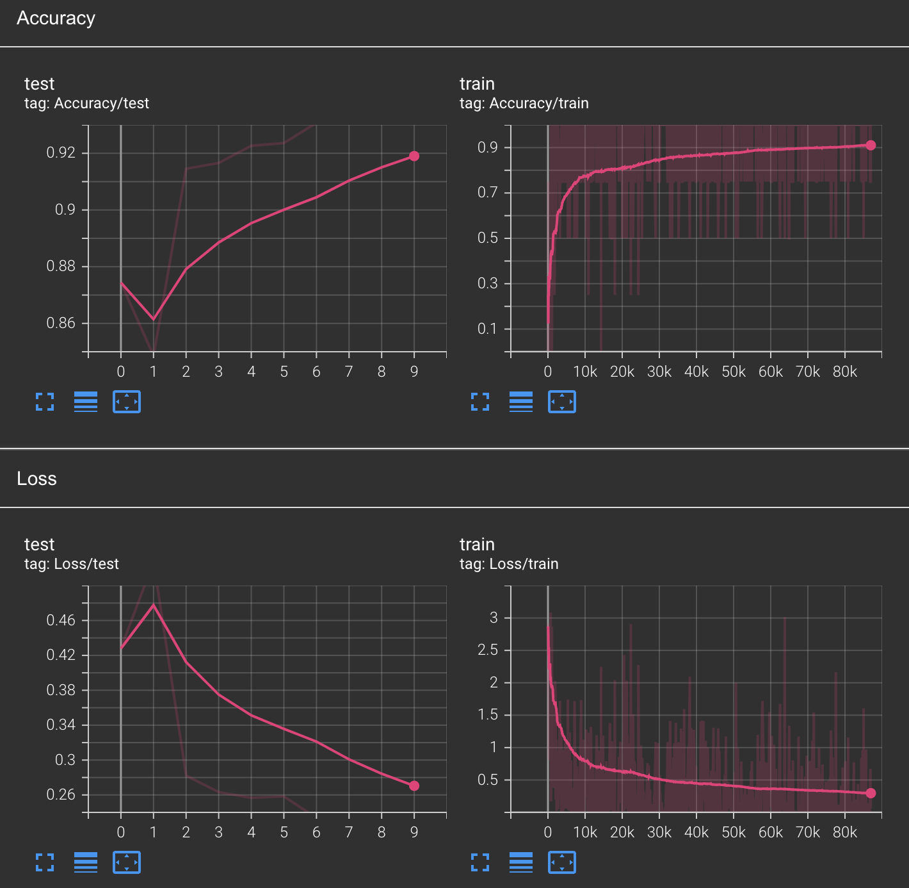

In seguito sono state create le 3 confusion matrix per valutare le performance del modello, rispettivamente per il test set Sintetico, Hololens e GoPro:

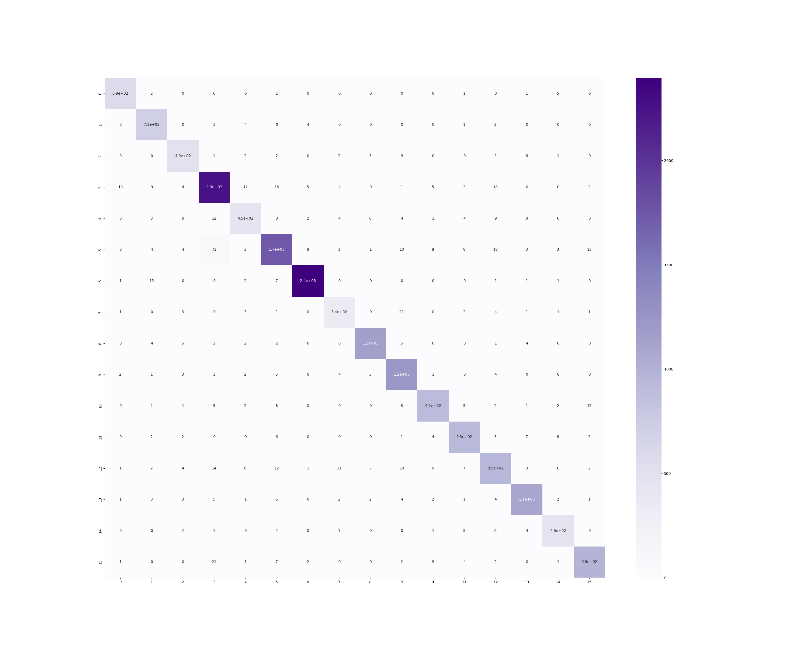

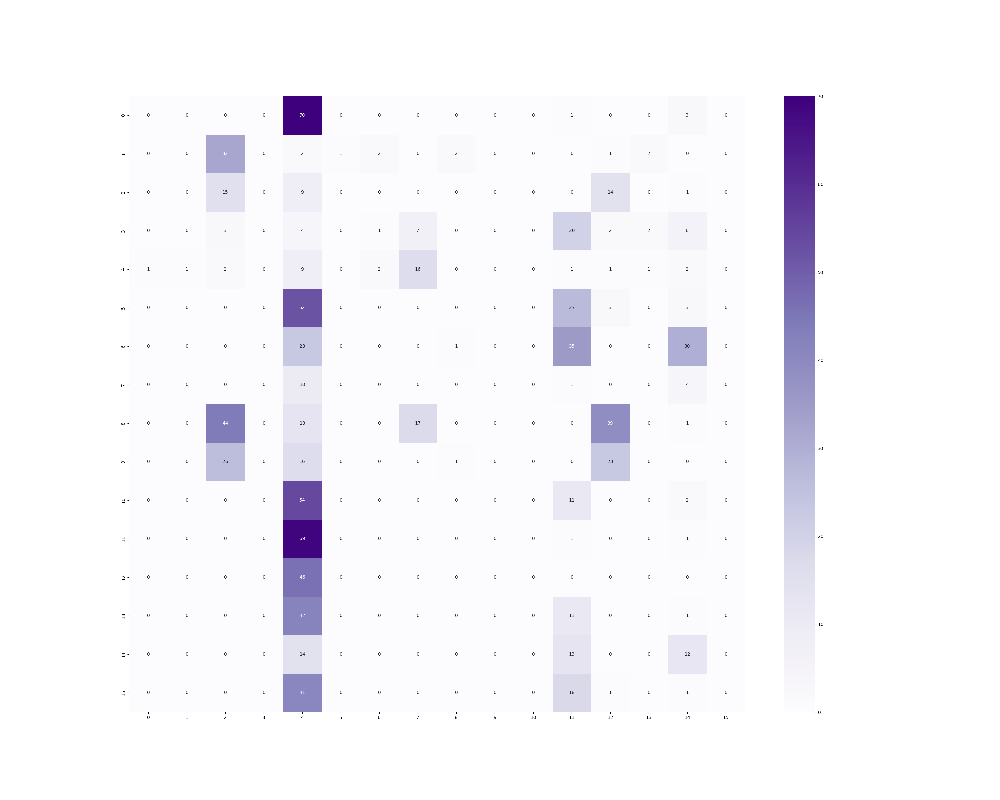

Sono stati inoltre calcolati i valori di precision, recall e f1 score per ogni classe, e sono stati ottenuti i seguenti risultati:

|    | Synthetic |Hololens |   Gopro |
|---:|----------------|---------|--------|
|  Accuracy | 0.9554563151265315 |      0.05779569892473118 |    0.03923647932131495 |
|  Precision | 0.9499501777656898 |      0.05061958675421942 |    0.020514805228783742 |
|  Recall | 0.9491773372356248 |      0.08557710367030441 |    0.08557710367030441 |
|  F1 Score | 0.9493945749914647 |      0.0425641743445889 |    0.0425641743445889 |

È evidente che, nonostante il modello abbia ottenuto un'accuracy molto alta sul test set sintetico, non è riuscito a generalizzare bene sulle altre due tipologie di immagini. Questo è possibilmente dovuto al fatto che il dataset sintetico presenta immagini molto diverse da quelle reali, inoltre squeezenet è un modello molto leggero, e quindi non è in grado di catturare tutte le informazioni necessarie per classificare correttamente le immagini.

### Esperimento 2 - Resnet18

Per il secondo esperimento è stato utilizzato il modello resnet18, che risulta essere più pesante di squeezenet, ma che permette di ottenere risultati migliori. Inoltre, si è deciso di utilizzare solamente l'unione dei dataset reali come training e validation set, con uno split 80/20. Di seguito Le confusion matrix per Hololens e GoPro:

Hololens:
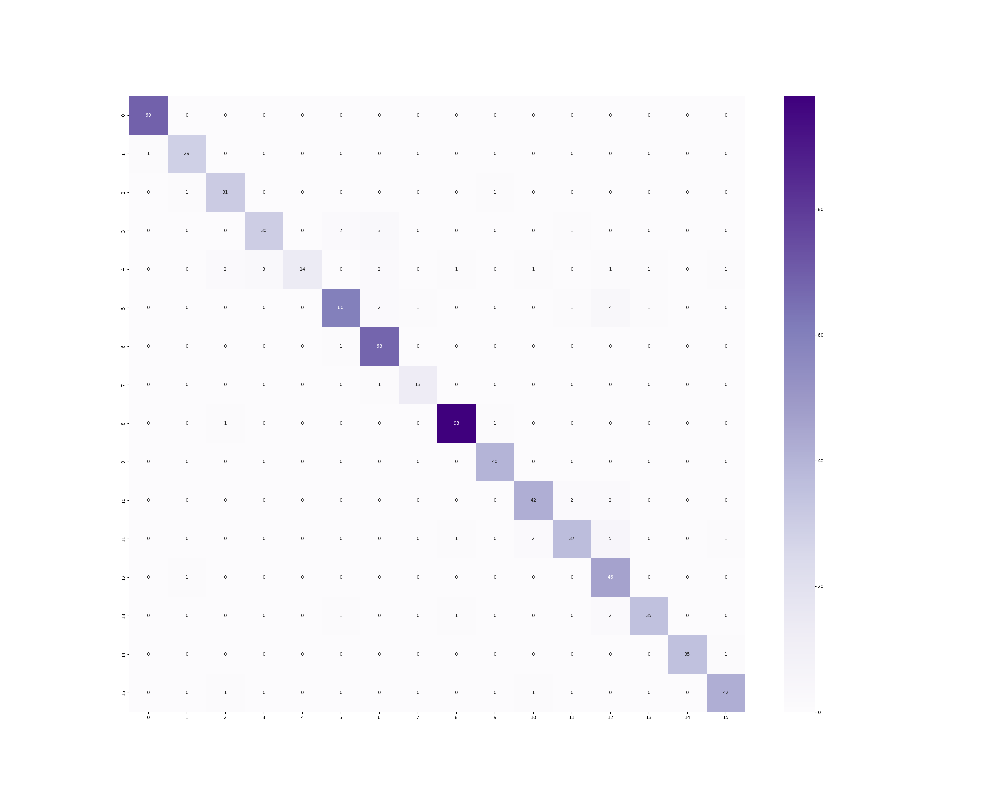

GoPro:

Sono stati inoltre calcolati i valori di precision, recall e f1 score per ogni classe, e sono stati ottenuti i seguenti risultati:

|    |Hololens |   Gopro |
|---:|---------|--------|
|  Accuracy|      0.9260752688172043 |   0.9406150583244963 |
|  Precision |      0.928807378302806 |    0.9372100645592133 |
|  Recall  |     0.9101136033126089 |    0.9381410857898521 |
|  F1 Score|      0.9136667007144954 |    0.9341699938629497 |

## Demo
È stato creato un file python chiamato "demo.py" che permette di testare il modello con un'immagine scelta dall'utente. Per farlo, è necessario eseguire il comando `python demo.py <path>`. Il programma restituirà in output il nome dell'opera riconosciuta, e la probabilità che l'opera riconosciuta sia quella corretta.
Nel caso in cui l'immagine facesse parte del dataset, il programma restituirà anche la classe corretta dell'immagine.
Verrà inoltre mostrato un plot con la probabilità di ogni classe, e l'immagine stessa.

Di seguito degli esempi di output:

Output 1: 
- True Class:  7  |  L'immacolata Concezione e Dio Padre in Gloria  
Predicted Class:  7  |  L'immacolata Concezione e Dio Padre in Gloria  |  0.9319925904273987

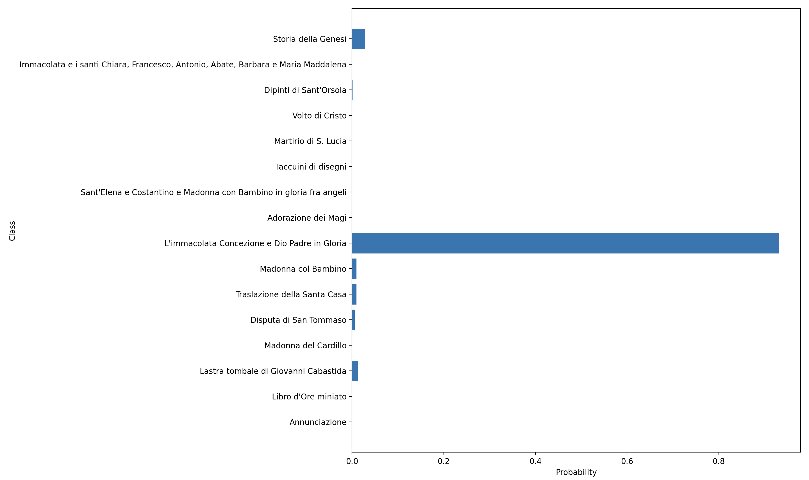

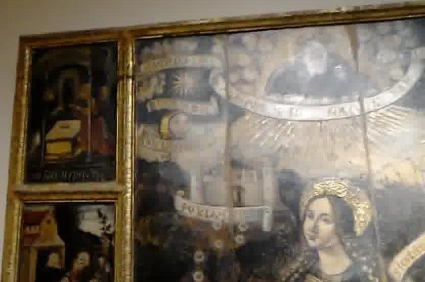

Output 2: 
True Class:  8  |  Adorazione dei Magi
Predicted Class:  8  |  Adorazione dei Magi  |  0.9999988079071045

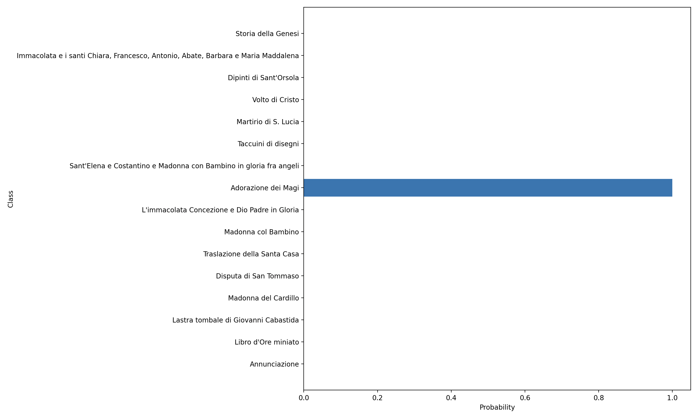

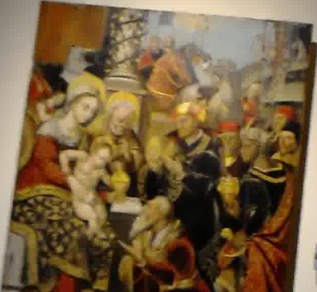

Output 3: 
True Class:  13  |  Dipinti di Sant'Orsola
Predicted Class:  14  |  Immacolata e i santi Chiara, Francesco, Antonio, Abate, Barbara e Maria Maddalena  |  0.8449711203575134

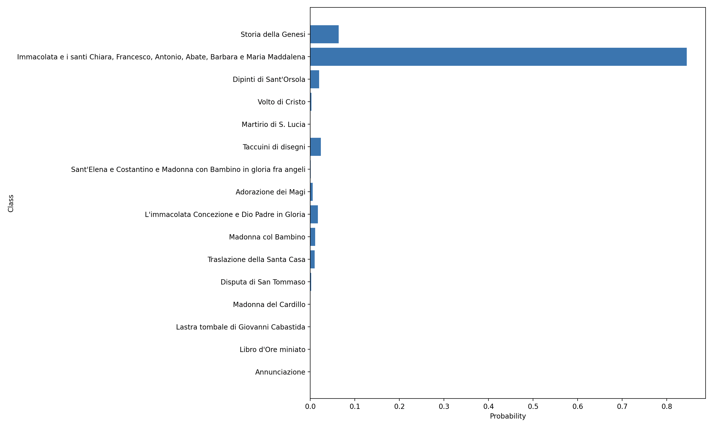

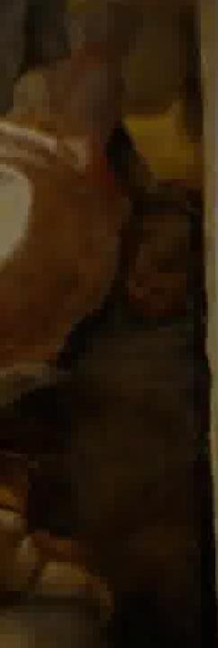

Output 4: (Tentativo con immagine esterna al dataset dell'Annunciazione)  
Predicted Class:  0  |  Annunciazione  |  0.9682266116142273

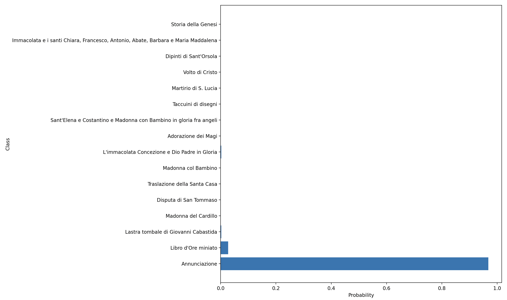

Nella root del progetto è presente un video dimostrativo che mostra il funzionamento della demo, con nome "Demo.mov".

## Codice
È stato scelto di sfruttare le potenzialità di jupyter notebook per la creazione del codice, in quanto permette di visualizzare i grafici direttamente all'interno del notebook, e di eseguire il codice in maniera modulare.
Eseguendo interamente il notebook si potranno effettuare i seguenti passaggi:
- Creazione del dataset preprocessato
- Creazione del modello
- Training del modello
- Valutazione del modello

La Demo è invece contenuta in un file python a parte, eseguibile da terminale.

Per eseguire correttamente il notebook è necessario prima scaricare il <a href="https://iplab.dmi.unict.it/OBJ-MDA/OBJ_MDA.zip">dataset originale</a>, estrarlo ed inserirlo nella cartella "data".
Ci si aspetta il seguente percorso: "data/MDA_Bellomo".

## Conclusioni

Questo progetto ha reso possibile la creazione di un classificatore che, dato in input un'immagine, restituisce in output il nome dell'opera rappresentata. Nonostante il numero ridotto di epoche a causa delle risorse limitate, il modello è riuscito a raggiungere un'accuracy del 93% sul test set, dimostrando di essere in grado di generalizzare bene sulle immagini reali. Questo dimostra come il fine tuning di un modello preallenato sia un ottimo metodo per creare un classificatore con poche risorse, e riducendo di molto il tempo necessario per l'allenamento.